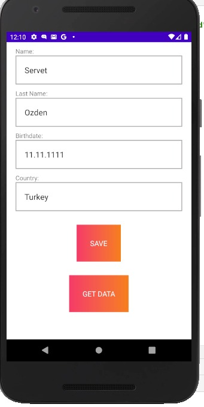
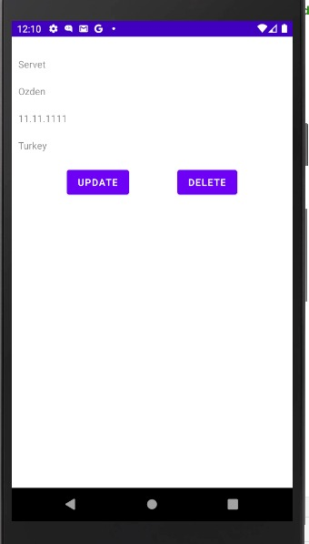

# AndroidRoomDatabase
Apps that handle non-trivial amounts of structured data can benefit greatly from persisting that data locally. The most common use case is to cache relevant pieces of data so that when the device cannot access the network, the user can still browse that content while they are offline.

## Advantages of Using Room
Compile-time verification of SQL queries.
Convenience annotations that minimize repetitive and error-prone boilerplate code.
Streamlined database migration paths.

## Add record

For example, I added 4 input fields.<dt>
I hold these records in my hand and print them on the screen thanks to the recycler view.<dt>

## Listing records <dt>

